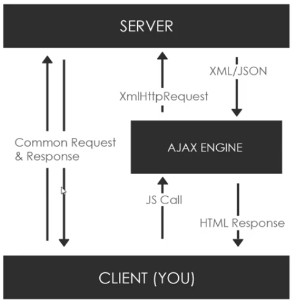

# Asynchronous JavaScript

- Synchronous Code

  - Waits for an statement to complete it's full execution and then goes to the next statement
  - Called blocking code, as it slows things down
  - ```js
    posts = loadPostsSync();
    // ... wait till posts are fetched
    // ... do something with the posts

    doTheNextThing(); //  has to wait till the posts loads
    ```

- Asynchronous Code

  - Doesn't wait for the execution to commplete
  - Much Faster
  - ```js
    loadPostsAsync(function () {
      // ... wait till posts are fetched
      // ... do something with the posts
    });

    doTheNextThing(); // doesn't has to wait till the posts loads
    ```

- Ways to handle Async Code
  - Callbacks
  - Promises
  - Async/Await

# Ajax

- Stands for: Asynchronous JavaScript and XML
- Not a language/framework/library - it's a set of web technologies
- Send and Receive data from and to clinent and server _asynchronously_
- Done behind the scenes without explicitly reloading the page: doesn't interfare with the current page
- XML is included in the Ajax acronymn, though JSON has replaced XML: easier, faster, popular
- Ajax can also work with plain text
  
- Make async requests in background
- No reload - So, Ajax is much faster
- Fetch data
- Very interactive
- The Ajax Engine
  - For ajax to work, an ajax engine is an intermediate between the client and server
  - The client makes an ajax call or an asynchronous javascript call
  - The Ajax Engine uses the XMLHTTPRequest(XHR) object to communicate with the server
  - The server returns in JSON format (or XML/Plain Text)
  - We can parse this data in our application
  - All theses stuufs are done without a page refresh!
- Libraries to make requests
  - Fetch API: part of core browser javascript
  - Axios
  - Superagent
  - jQuery
  - Node HTTP

## XMLHTTPRequest(XHR) object

- Core technology in Ajax
- Provided by the browser's javascript enviornment
- Transfers data between server-client
- Can be used with other protocols like: HTTP
- Can work on data other than XML, like JSON and plain text
- Syntax

```js
// create an XHR object
const xhr = new XMLHttpRequest();

//open
/*
    params in order:-
    - type of request
    - file to which request is made
    - making async request, hence: true
  */
xhr.open("GET", "data.txt", true);

// used for spinners/loaders
xhr.onprogress = function () {
  console.log(this.readyState);
};

// onload
xhr.onload = function () {
  //  do whatever we wannt to do with the data that we get

  // checking HTTP status. 200: "OK"
  if (this.status === 200) {
    console.log(this.responseText); //  the data coming with the response
  }
};

// if something goes wrong
xhr.onerror = function () {
  console.log("Request Errro");
};

// to finalize everything
xhr.send();
```

### Few HTTP Statues

- 200: OK
- 403: Forbidden
- 404: Not Found

### Ready State values

- 0: Request not initiated
- 1: Sever Connection established
- 2: Request Recieved
- 3: Processing request
- 4: Request finished and the response is ready

### `xhr.onreadystatechange`

- `xhr.onload` is a new way, earlier, `xhr.onreadystatechange` was used!
- Using `xhr.onload` we are already in the `readyState` `4`
- Syntax

```js
xhr.onreadystatechange = function () {
  if (this.status === 200 && this.readyState === 4) {
    console.log(this.responseText);
  }
};
```

# REST API
- API in general
  - Application Programming Interface
  - Contract provied from one piece of software to another
  - Structured `request` and `response`
- REST
  - REpresentational State Transfer
  - Architecture style for designing networked applications
  - Relies on Stateless, Client-Server protocol, almost always HTTP
  - Treats server objects as resources that can be created or destroyed
  - Can be used by virtually any programming language
  - All APIs have their own rules and structure
  - API is the messenger and REST uses HTTP to format that message

## Different types of requests
- `GET`: Retrive data from specific resource
- `POST`: Submit data to be processed to a specific resource
- `PUT`: Update a specific resource
- `DELETE`: Delete a specific resource
- `HEAD`: Same as `GET` but doesn't return a body
- `OPTIONS`: Returns the supported HTTP methods
- `PATCH`: Update partial resources

| Request | URL(Endpoints) | Comments |
|---------|----------------|----------|
| `GET` | `https://someurl.com/api/users` | Get all users |
| `GET` | `https://someurl.com/api/users/1` | Get single user |
| `POST` | `https://someurl.com/api/users` | Add user |
| `PUT` | `https://someurl.com/api/users/1` | Update user |
| `DELETE` | `https://someurl.com/api/users/1` | Delete user |

> Find a similar table in the [RESTful Blog](https://github.com/Kinjalrk2k/RESTful-Blog#restful-routes-table) repository!

# Callback Function
- A callback function is a function which is passed in another function as a parameter
- We have synchronous and asynchronous callbacks
- Functions like ```forEach()```(synchronous) ```setTimeout()```(asynchronous) use callbacks

# ES6 Promises
- Promises are alternatives of callbacks
- They are called promises because while they handle asynchronous operations, they can promise to do something when the operation is finished
- We can handle a promise response with `.then`
- A function must return a `Promise` object for `.then` and `.catch` to work
- Syntax
```js
function doThisFirst() {
  return new Promise(function(resolve, reject) {
    /*
    ... do stuffs here ...
    */

    if(!error) {
      resolve();  // ready for the .then function
    } else {
      reject("Error!"); //  goes in the .catch (throws an error)
    }
  })
}

function doThisLater() {
  /*
  ... do stuffs here ...
  */
}

dothisFirst().then(doThisLater).catch(function(err) {
  /* Handle the error */
})
```